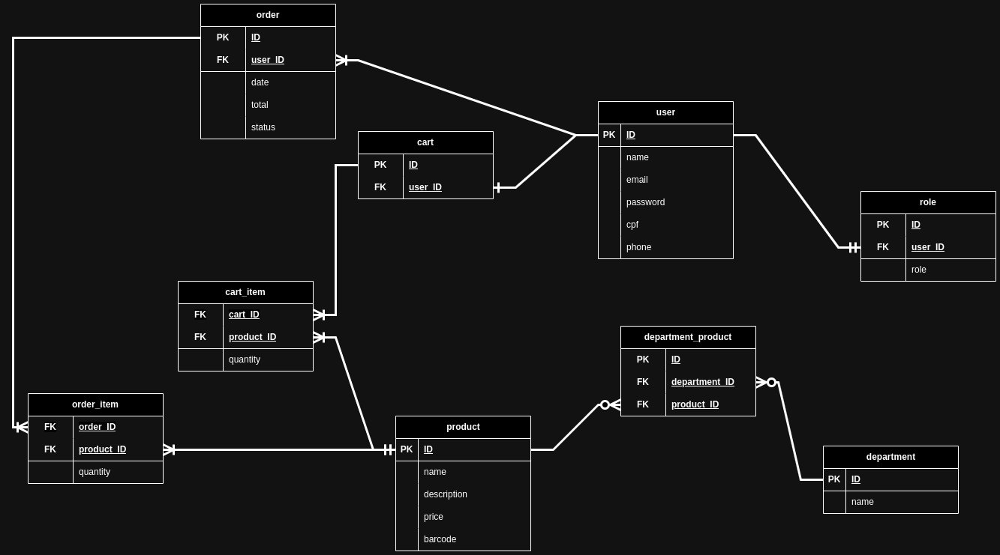

# Online Market System
## This project is under development and aims to create an online store for an existing physical market using Express, TypeScript, and TypeORM. The system allows customers to browse and purchase products from the market remotely. 

## Key features:

- Product Catalog: Browse products categorized by departments, including descriptions, prices, and availability.
- User Registration and Authentication: Secure registration and login system for customers.
- Shopping Cart: Ability to add products to a cart for later purchase.
- Order Management: Place orders, view order history, and track delivery status.
- Payment Integration: Integration with a payment gateway for secure online transactions.
- Responsive Design: Mobile-friendly interface to ensure accessibility across devices.
- Administrative Tools: Backend dashboard for market administrators to manage products, orders, and customer accounts.

## Entity Relationship Diagram

 
